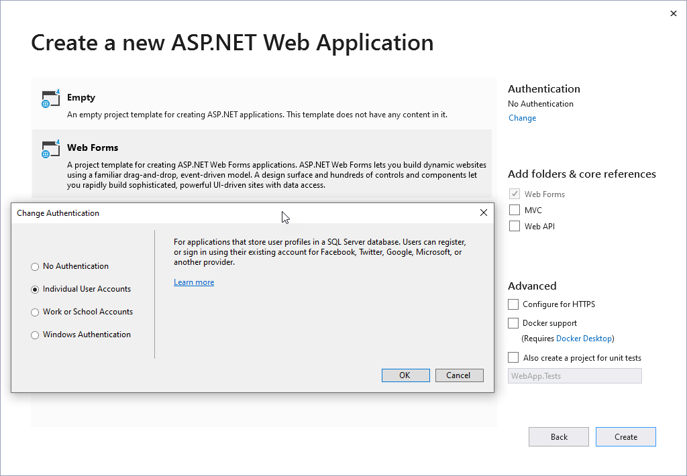
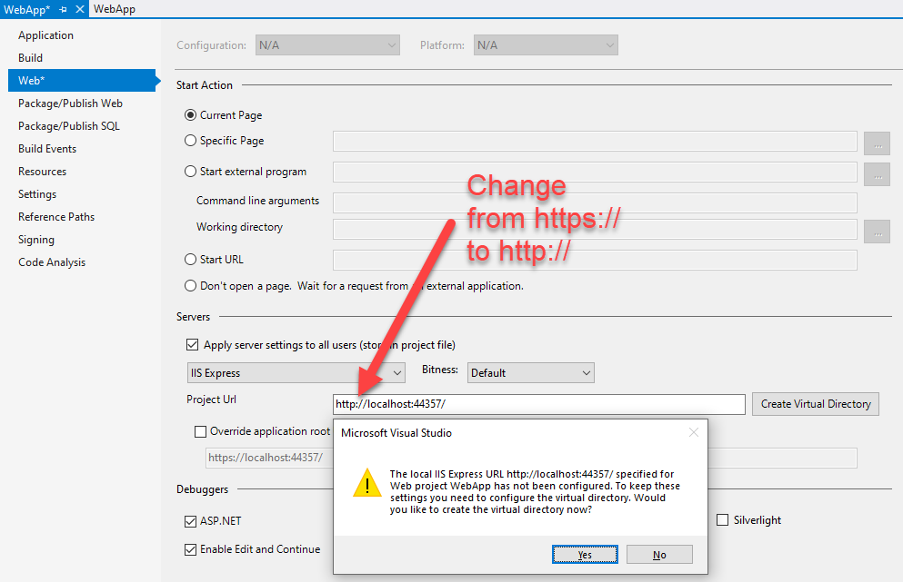
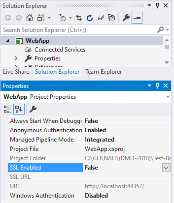

# DMIT 2018 Lab Specs

> This is a team project based on the [**eRace database**](./Database/ReadMe.md).


**Team Project Size: 4 members.** The team project consists of a set of **baseline requirements** and four **core scenarios** (subsystems). Each team member is responsible to complete one subsystem on their own; the baseline requirements are to be shared equitably by all members of the team. The core scenarios are:

- [**Purchasing**](Purchasing/ReadMe.md)
- [**Racing**](Racing/ReadMe.md)
- [**Receiving**](Receiving/ReadMe.md)
- [**Sales**](Sales/ReadMe.md)

> This is a **Team** project. You are only allowed to discuss your project solution with members of your own team. Discussion of the project details with other teams is prohibited. **Collaboration with members from *other teams* will be considered a breach of academic integrity and will be treated as such!**
>
> You will need to work as a team to coordinate your efforts. It is your responsibliity to ensure all commits are made to your repository and that you correctly and promptly resolve any merge conflicts.
>
> If you have questions about this lab, please raise them with your instructor. Your instructor will be reviewing the lab requirements in-class; you are expected to be present and ready to ask your questions at that time.

> You are expected to make **regular** and **frequent** commits while working on this project. **Begin early** to ensure that you have enough time to complete this group project!

## Deliverables

This lab is broken up into the following deliverables. Your instructor will inform you of the due-dates for these deliverables. You should take note of the [**Marking Guide**](Marking.md).

> *Due dates for each deliverable are subject to change. Check with your instructor for the latest information.*

1. **10% - [Development Planning](#development-planning)** - (**Nov 16, 5PM**~~*3rd class of Week 10*~~) - The development planning deliverable is where you document your plan for completing your scenario. The details for this requirement can be found in this document.
2. **5% - [Baseline Requirements](#baseline-requirements)** - (**Nov 23, 5PM***~~3rd class of Week 11*~~) - The baseline requirements constitute the general setup of your solution in your code repository. The details for this requirement can be found in this document.
3. **25% - Final Solution** - (*1st class of Week 15*) - The final solution will consist of the working implementation of your team members' individual scenarios. The scenarios must be integrated as a single Visual Studio solution. The details for your individual scenario requirements can be found in the following documents.
      - [**Purchasing**](Purchasing/ReadMe.md)
      - [**Racing**](Racing/ReadMe.md)
      - [**Receiving**](Receiving/ReadMe.md)
      - [**Sales**](Sales/ReadMe.md)

----

## Development Planning

> **NOTE:** This lab offering *may* include sequence diagrams and class diagrams for the use cases involving transactional processing. When provided, you must follow the guidance of those diagrams. Details can be found in the individual scenario specifications.

Your development plan documentation must be written **using the guidelines and examples demonstrated by your instructor**. Your documentation must be placed in a subfolder with *your* name at the root of the repository. All the supporting files for your documentation (raw diagram files and images) must also be placed in this folder. For example, if your instructor requires a markdown document and your name is *Stewart Dent*, then your documentation file path would be `/StewDent/ReadMe.md`. Also include each team member's name and their subsystem in the `ReadMe.md` at the root of your repository.

The content and structure of your documentation will be **directed by your instructor**. Be aware that each instructor may choose various components in your documentation which may include (but not be limited to) some or all of the following components.

- **User Interface Mockups** - Mockup images of the screens/web pages that the user interacts with. These may consist of entire screen mockups or mockups of parts of the screen that reflect key perspectives of the user's interaction with the application.
- **UI/BLL/DAL Mappings** - Charts or lists detailing the UI events/interactions and how they map through calls to the BLL and DAL of your subsystem.
- **Proposed View Models** - Coded classes acting as View Models for Command and Query behaviour.
- **Class Diagrams** - A set of class diagrams, one for each DTO/POCO used in the planning document.
- **Use Case Diagram** - A single diagram illustrating the interactions of the user with your subsystem.
- **Sequence Diagrams** - A set of sequence diagrams for each use case. The scope of the diagram only needs to include the presentation layer (user) and the business logic layer (BLL). It needs to clearly indicate the complete method signatures used when interacting with the BLL as well as the data types of information returned from the BLL.

Diagrams should be stored in your repository as **both** the **raw format** (`.bmpr` for a [Balsamiq](https://balsamiq.com/) diagram, `.xml` for a [Draw.io](https://www.draw.io/) diagram, or `.vdx` for a Visio download of a [LucidChart](https://www.lucidchart.com/) diagram) and as **individually exported images**.

When developing your planned implementation for your scenario, you must take into consideration the practices and patterns demonstrated in this course.

----

## Baseline Requirements

There are three stages to accomplishing the baseline requirements.

- [DMIT 2018 Lab Specs](#dmit-2018-lab-specs)
  - [Deliverables](#deliverables)
  - [Development Planning](#development-planning)
  - [Baseline Requirements](#baseline-requirements)
    - [Stage 1 - Project Setup](#stage-1---project-setup)
    - [Stage 2 - Security Setup](#stage-2---security-setup)
    - [Stage 3 - Subsystem Setup](#stage-3---subsystem-setup)
      - [Sales Modifications](#sales-modifications)
    - [Image Credits](#image-credits)

The first two stages are to be completed by different team members. For the third stage, each team member must set up the subsystem for their selected scenario. **Use GitHub issues** to delegate different tasks to each team member; some will complete the **Project Setup** while the one will complete the **Security Setup**. Divide up the tasks a equitably as possible. When performing commits of your code, be sure to reference the issue number in your commit so that your work can be easily distinguished by your instructor.

### Stage 1 - Project Setup

Using the techniques and practices demonstrated in class, set up the repository by generating the following items.

1. Ensure the **`ReadMe.md`** file at the root of your repository has the following:
     - Group Logo
     - Team member names linked to each person's chosen subsystem
1. Create VS solution
     - Web Application
     - Class Library(ies)
     - NuGet packages updated
     - References between projects
1. Website Subfolders
     - One for each subsystem
     - `Default.aspx` page in each subsystem folder with an `<h1>` stating the subsystem name
1. Root `Default.aspx` of your website (the *Home* page) must include the following
     - Group Logo
     - Team member names
       - Subsystem
       - Setup/Security Responsibilities
       - Known Bugs list
1. `About.aspx` must include the following
     - List of users with their security roles and passwords
     - Database connection string details for development
1. `Site.master` must include the following
     - Working navigation to default pages for subsystems
1. Reverse Engineer database
     - Ensure additional instructor requirements for entity/DAL classes (e.g.: `internal` vs `public`)
1. Shared Controller (Optional)
     - You can create a single shared controller class for listing view model information for use in common drop-downs across the system.

The ReadMe must include information about your designated team number/letter, your chosen team name, and the names of your team members. ***Clearly*** indicate which team members are handling which portions of the lab requirements (subsystem and project/security setup).

<!-- 
> **Disabling SSL** - When you create the Web Application, be sure to set up *Individual User Accounts*. Note that doing so will force the web application to "Configure for HTTPS". You must disable SSL for your project to work in the labs.
>
> 
>
> To disable SSL, first change the web application's project properties to use an `http://` url for the web; when you save these changes, click "Yes" for creating a virtual directory.
>
> 
>
> Lastly, change the "SSL Enbabled" setting to "False".
>
> 
-->

### Stage 2 - Security Setup

Using the techniques discussed in class, set up the security system for the application by complementing the ASP.Net Identity classes that form the supplied security framework when the project was first set up.

- Application User customization
  - Employee reference
- Automatic setup of security roles based on the values in the `Positions` table of the database
- Automatic registration of employees as users during database initialization, with employees added to security roles based on their job position
- Update of login/registration pages
- Document default username/password for the webmaster and the default initial password for employees; this documentation should be placed in an appropriate part of the web application to make it easy to find when the application is being tested.

### Stage 3 - Subsystem Setup

Each team member must create a subfolder under their class library's BLL folder. In there, you are to create a controller class for your subsystem. entities  In addition, you are to make the following modifications to the entities in your subsystem.

#### Sales Modifications

In the DAL's `OnModelCreating()` method, make the following modifications to navigational properties on the entities. (Use Visual Studio's [renaming capability](https://docs.microsoft.com/en-us/visualstudio/ide/reference/rename?view=vs-2019) to ensure the properties are correctly changed in all code locations.)

```csharp
     // Each Invoice must be comprised of one or more InvoiceDetails
     modelBuilder.Entity<Invoice>()
          .HasMany(e => e.InvoiceDetails)
          // Each InvoiceDetail must be a part of one and only one Invoice
          .WithRequired(e => e.Invoice)
          .WillCascadeOnDelete(false);

     // Each Invoice may be issued as a refund for one or more StoreRefunds
     modelBuilder.Entity<Invoice>()
          .HasMany(e => e.StoreRefunds)
          // Each StoreRefund must be repaid through one and only one Invoice
          .WithRequired(e => e.RefundInvoice)
          .HasForeignKey(e => e.InvoiceID)
          .WillCascadeOnDelete(false);

     // Each Invoice may be eligible to include one or more StoreRefunds
     modelBuilder.Entity<Invoice>()
          .HasMany(e => e.ReturnedItems)
          // Each StoreRefund must be for something that was purchased on one and only one (original) Invoice
          .WithRequired(e => e.OriginalInvoice)
          .HasForeignKey(e => e.OriginalInvoiceID)
          .WillCascadeOnDelete(false);
```

----

### Image Credits

- Go-Kart race track Image by <a href="https://pixabay.com/users/AJP_Photography-2011528/?utm_source=link-attribution&amp;utm_medium=referral&amp;utm_campaign=image&amp;utm_content=3344550">Alex Pearson</a> from <a href="https://pixabay.com/?utm_source=link-attribution&amp;utm_medium=referral&amp;utm_campaign=image&amp;utm_content=3344550">Pixabay</a>
- Clip-Art Image by <a href="https://pixabay.com/users/OpenClipart-Vectors-30363/?utm_source=link-attribution&amp;utm_medium=referral&amp;utm_campaign=image&amp;utm_content=161385">OpenClipart-Vectors</a> from <a href="https://pixabay.com/?utm_source=link-attribution&amp;utm_medium=referral&amp;utm_campaign=image&amp;utm_content=161385">Pixabay</a>
