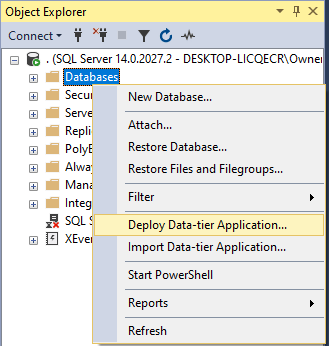

# Installing The eRace Database

The [eRaceDb.dacpac](./eRace.dacpac) has been provided for you to install the database. Using Sql Server Management Studio (SSMS), simply right-click on *Databases* in the *Object Explorer* and choose "Deploy Data-tier Application...", then follow the instructions in the dialog.

