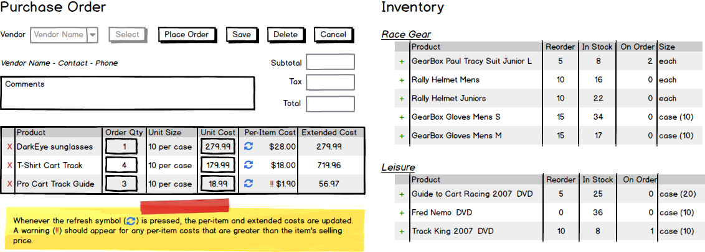
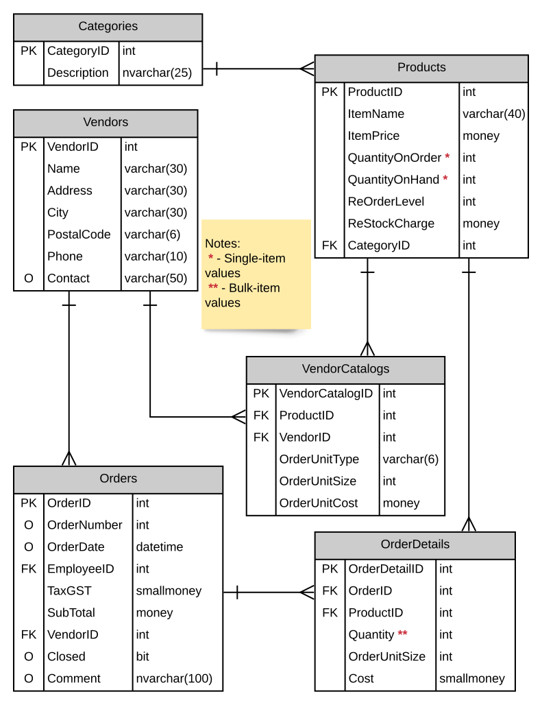

# Purchasing Subsystem 

## Business Process Overview

> *Employees must log onto the system. Purchasing must only allow authenicated users within the **Director** and **Office Manager** roles to have access to this subsystem. The Employee full name must appear somewhere on the form.*

Purchases are to a specific vendor. A vendor may or may not have a purchase order currently active that is not yet placed. A purchase order that is currently active but not yet placed will have a null Order Date and Order Number on the database record. An order may be created over several work sessions until a decision is made to actually place (send the order) to the vendor. A vendor may have **only one active purchase order** on file at a time. When a vendor is selected, load either the active order (if present) or an empty (new/unsaved) order.

### Current Active Order

A current active order is an existing order which has not yet been placed. This is an order that contains items that are being considered for purchasing from the vendor. The director may make any alternations to this order by adding more items, adjusting quantity and price for items, and removing items from the order list. A current active order is identified by **not** having an Order Date and a Purchase Order Number.

### Placed Order

Once the director is satisfied with the purchase order, they may "place" the purchase order. When the order is placed, the Order Date is filled with the current date during the transaction process. The Purchase Order Number must be generated at this time using the next available order number. This purchase order is now ready for receiving and **can no longer be altered.**

### Requirements

Business Rules and Form Processing:

- Each vendor can have zero or one "currently open" purchase orders (PO).
- A "currently open" purchase order is one where the Order Date and Purchase Order Number are `NULL`
- The Purchase Order (PO) display will hold the current purchase order detail items.
- Inventory items can only appear on the order once.
- Form Requirements and Usage:
  - Vendor Area: A drop-down listing current vendors. Drop-down has [Select a Vendor] as the first item. Order totals/tax are set to zero. Vendor contact area is empty.
  - A button beside the Vendor Drop-down will cause either:  
    - (a) Editing of the current order
      - the current open order to be retrieved and displayed
      - display of vendor stock items
      - current order is open until a **place order** is clicked
    - (b) Presentation of an empty order
      - display of all vendor stock items
      - empty list with headings only if this is a new order
  - Vendor information is to be displayed when an order is being edited
  - Control command buttons
    - Purchase Order Action - Remove Item
      - Remove the line item from the Purchase Order
      - Refresh the page
    - Current Inventory Action - Add to Order
      - Add the line item to the Purchase Order
      - Refresh the page
  - Form Process Buttons - ***Do not save** changes to the database unless the **Save** or **Place Order** buttons are pressed; the edited state of the purchase order is to be maintained in the form itself.
    - **Save** will do bulk-update processing of the currently displayed purchase order but will **not** place the order.
    - **Place Order** will bulk-update and set the Order Date and a new Purchase Order Number for the current order as well as update the QuantityOnOrder for each stock item on the purchase order.
    - **Cancel** will clear the web page of the current purchase order and reset the vendor list to the vendor prompt line (thus allowing the user to select a new vendor).
    - **Add** (plus sign) will add the inventory item to the order with a quantity of 1. Items can only appear on the order once. You may decide how you want to process re-adding items (e.g.: deny adding or increment quantity on order with a message to the user).

> **Note:** Quantity values in the **`Products`** table are as *single items* - thus, a `QuantityOnHand` of 12 for KitKat bars means 12 individually packaged KitKats. For the **`OrderDetails`** table, the `Quantity` value is a *bulk quantity* - thus a quantity of 3 with an `OrderUnitSize` of 20 means that we are expecting *60* items to be shipped. See the `VendorCatalogs` table for clarifications on order unit types, sizes and costs.

----

## ERD

The Purchasing subsystem uses the following tables in the database. Note that references to `EmployeeID` should be resolved against the logged-in user. Nullable columns are marked with an `O` for "Optional".

