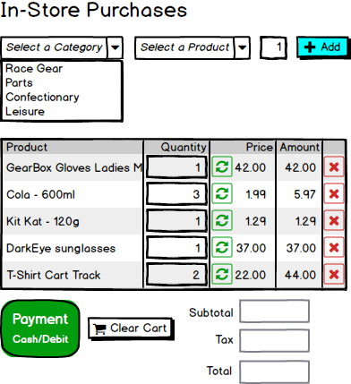
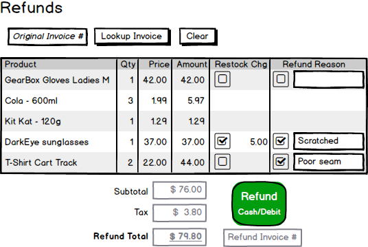
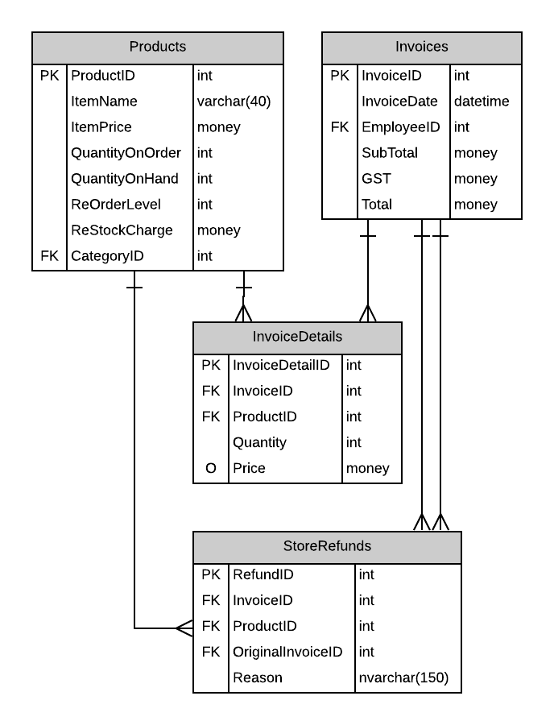

# Sales Subsystem 

> *Employees must log onto the system to access the Sales subsystem. In-Store Sales must only allow authenicated users within the **Clerk** Role to have access to this subsystem. The Employee full name must appear somewhere on the form.*

The Sales subsystem handles all in-store sales of products as well as refunds.

## In-Store Sales

Customers bring products to the counter for in-store purchases and the employee records each item in the screen on the employee's till. Items can be added and removed from the sales and the quantities can be edited; refresh the item subtotals when the refresh icon is clicked ().

> *Alternatively, you can choose to have the price automatically refresh when the focus is removed from the Quantity input for each item.*

When the customer pays, the employee clicks the **Payment** button and the entire sale is updated and processed as a single transaction.

The following rules should be considered in the behavior of in-store sales.

- The category and product drop-downs are to behave as cascading drop-downs.
- All products in the category are shown, even if they already exist in the sales list.
- Re-adding a product already in the list should increase the quantity of that product accordingly (don't show duplicate items in the list of items being purchased).
- Clicking the refresh button for any item updates the quantity for all items in the list.
- Subtotals, tax and grand total are to be re-calculated each time the quantity is modified for any item in the sale.
- When completing the payment, the quantities for each item must be updated as well (the user may have changed the quantities in the form just prior to clicking the **Payment** button)
  - Payment processing is to happen as a single complete transaction.
  - The payment process should update the quantity on hand for the products in the inventory.
  - Resulting negative values for quantities on hand is allowed (inventory status is updated in a separate stock-counting process at the end of each month).
  - The invoice results are to remain on the screen after the payment is complete. Show the invoice number on the screen as well.
  - Items cannot be added or edited after the payment is processed.
- Clicking the **Clear Cart** button empties the list and prepares the screen for a new sale.

----

## Refunds/Returns

Customer may bring items back for a refund, provided that they show their original receipt and that they give a reason for each item refunded. Currently, we only accept original-quantity refunds on items returned. Confectionary items are non-refundable.

> ***TIP:** To make your coding easier, improve the autogenerated navigational property names on `Invoice` and `StoreRefund` entities by renaming them according to the [Sales Modifications](../ReadMe.md#Sales-Modifications)

Use the following rules when processing returns.

- Refunds require the original receipt number in order to be processed.
- A refund always results in a new invoice being generated, this time with negative values for subtotal, GST and total.
- Individual item refunds are allowed, but only in the original quantity purchased. Partial item refunds are not allowed.
- A reason has to be supplied for each refund item.
- Confectionary items are non-refundable.
- The refund process is to happen as a single complete transaction.
  - The refund invoice results are to remain on the screen after the refund is complete. Show the invoice number of the refund.
  - The refund cannot be edited after it has been processed.
  - Refunds may be subject to a restocking charge.
  - In-stock inventory quantities need to be updated with all refunds, but the product itself is set aside for later inspection by a manager (who may return it to the supplier in a separate process).
  - If an item on an original invoice has already been returned/refunded, that item cannot be refunded a "second time" (which avoids refund frauds)
- Clicking the **Clear** button clears the screen

----

## ERD

The Sales subsystem uses the following tables in the database. Note that references to `EmployeeID` should be resolved against the logged-in user.

